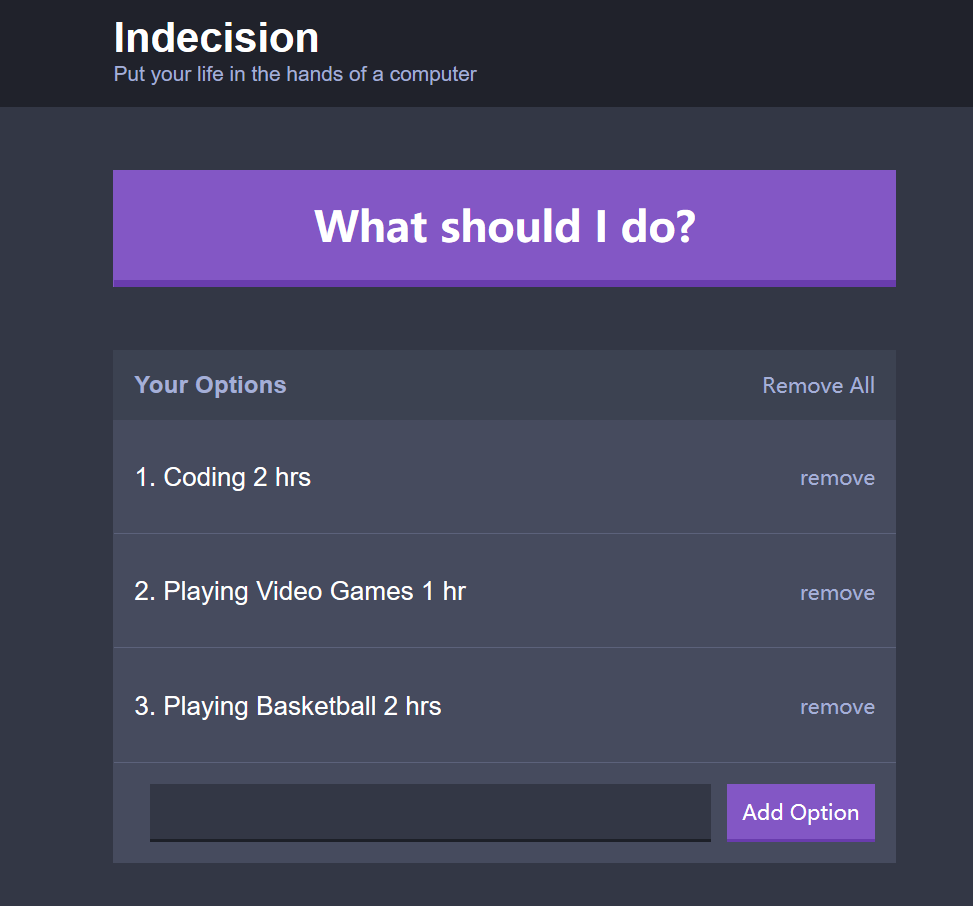
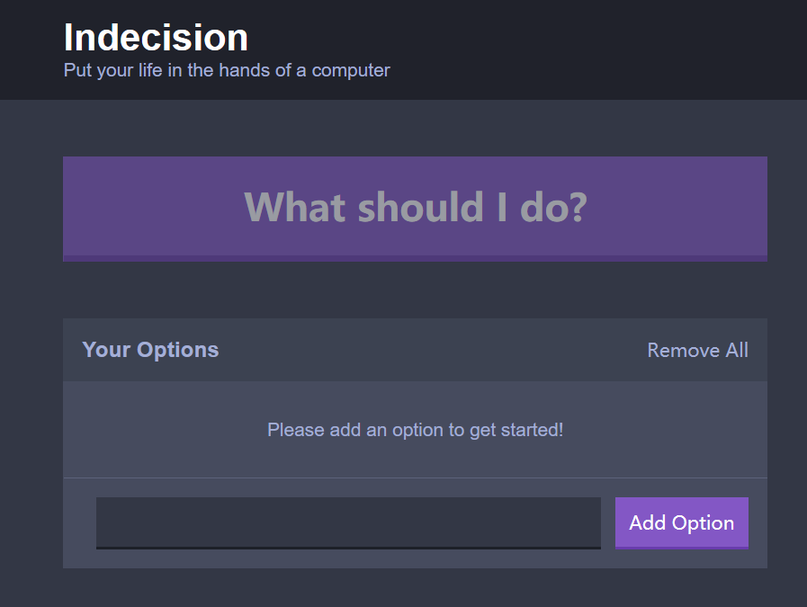
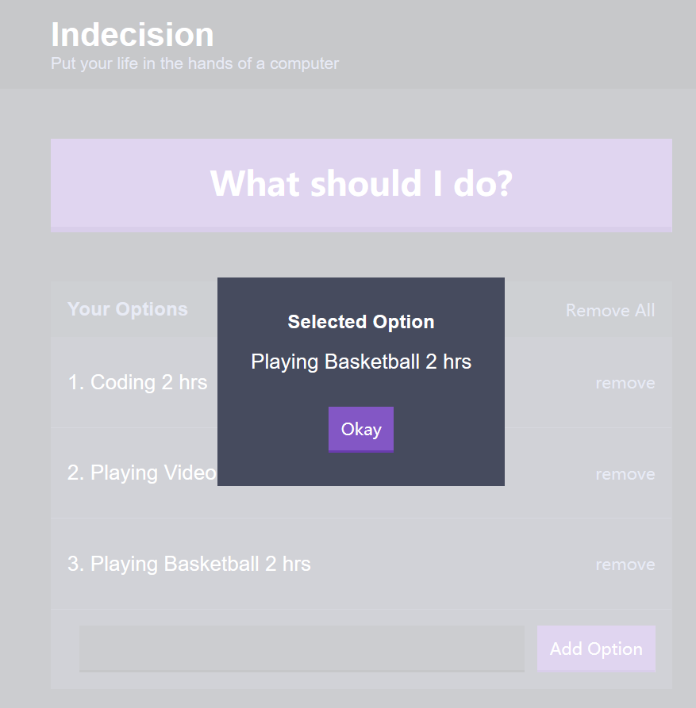

# React-Indecision
It's a simple React App.

You can add a new option and after you add some, you can click the 'What should I do' button to get a random option.
You can also remove the specific option or remove all the options.

#### Familiar with Git?
Checkout this repo, install dependencies, then start the gulp process with the following:

```
> git clone https://github.com/y394898139/React-Indecision.git
> cd indecision app
> npm install
> npm start
```

#### Screenshots of the pages

#### Indecision Page


#### Indecision Page With Some Options


#### Pick a random option from the options

